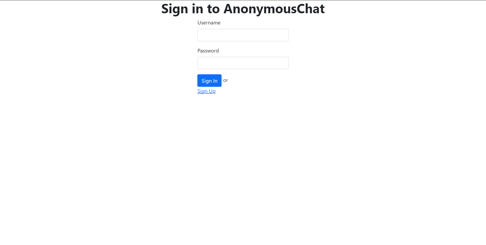
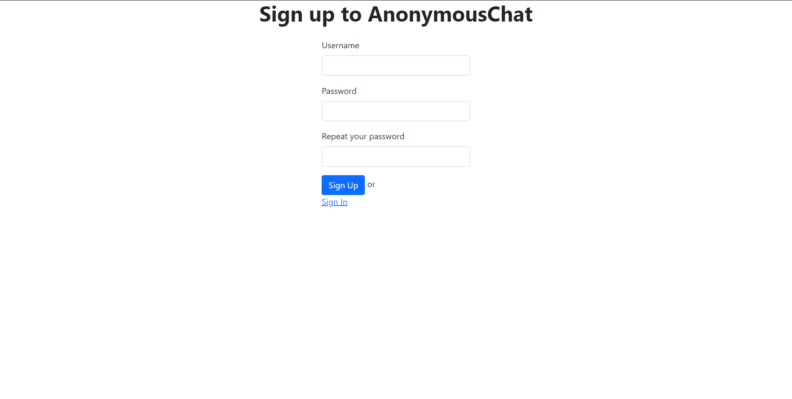
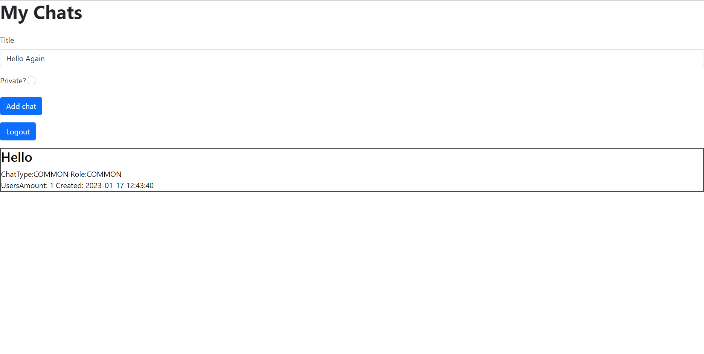
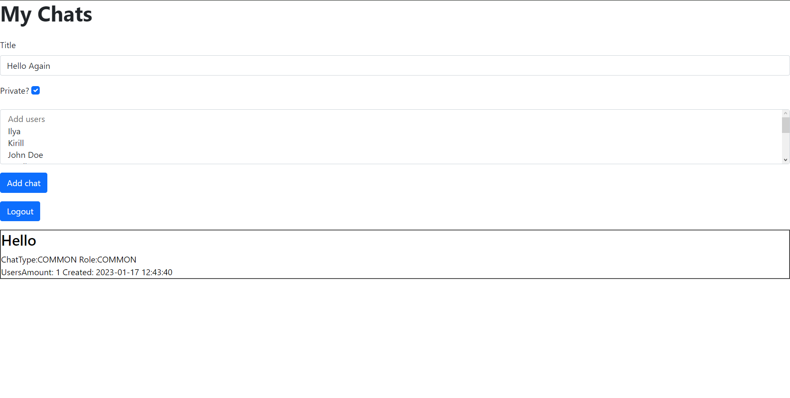
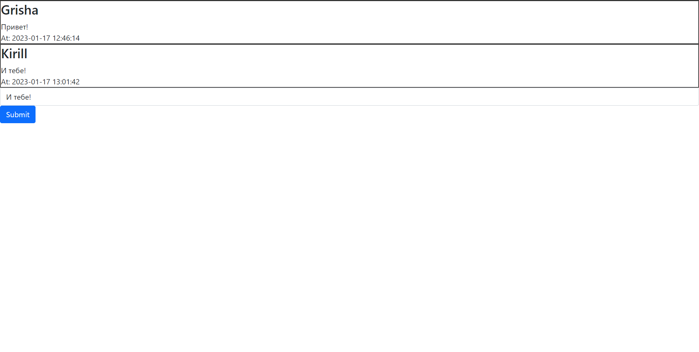
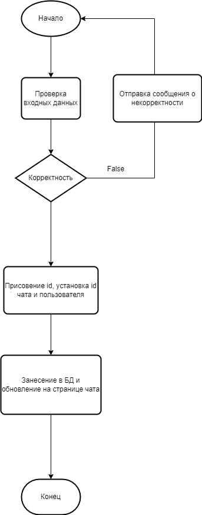
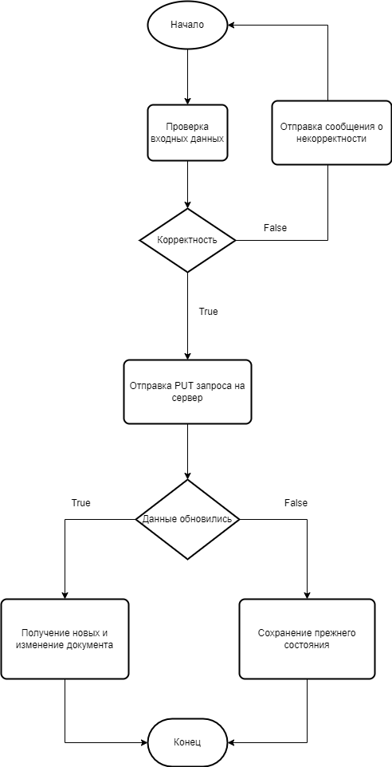
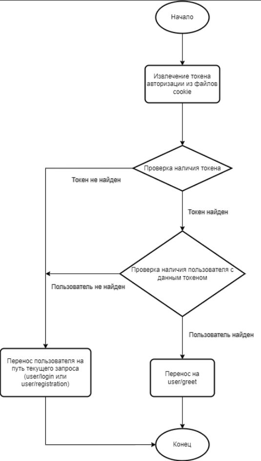
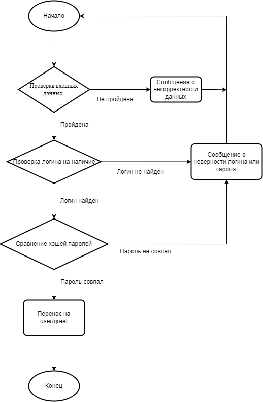

# Отчёт к лабораторной работе №3
----
# Текст задания
## Цель работы
Разработать и реализовать анонимный чат с возможностью создания каналов. В интервейсе отображается список каналов, пользователь может либо подключитьсяк существующему каналу, либо создать новый. Сообщениядоставляются пользователю без обновления страницы

## Дополнительные возможности
- приватные каналы (ограничение по никнеймам пользователей)
- автоматическое удаление сообщений через заданный интервал времени
- автоматическое удалениестарых каналов (неактивных)
защита от флуда (ограничение на количество отправляемых сообщений в минуту)
- фильтр слов
 ## Выполнено
 - приватные каналы (ограничение по никнеймам пользователей)

 ----
# Ход работы
## Пользовательский интерфейс
Страницы: авторизации(для добавления имён пользователей), добавления чатов/ просмотра чатов, просмотра сообщений
1. Страницы авторизации





2. Добавления/просмотра чатов



3. Пример списка пользователей



4. Добавления/просмотра сообщений



## Пользовательские сценарии работы
1. При вводе в адресной строке "/" пользователя переносит на "/chats", где если пользователь авторизован, выводится меню чатов. Чаты определяются по параметру запроса вида "/chats:id". Тут же на "/chats" имеется форма для создания нового чата. Чаты обновляются динамичсеки с использованием сетевых запросо fetch.
2. Для получения всех сообщений данного чата в хронологическом порядке и их динамического обновления используются запросы по адресу "/messages".
3. Для авторизации и регистрации используется адрес "/user".

## Описание API сервера, хореографии
В основе приложения использована клиент-серверная архитектура. Обмен данными между клиентом и сервером осуществляется с помощью HTTP GET, POST, PUT запросов. В теле POST запроса отправки поста используются следующие поля: nickname, password, rep_password, lastId. Для добавления чатов используется форма с названием чата, а также checkbox для опции приватности, которая показывает выпадающий список с именами пользователей. Для добавления сообщений используется форма с текстом.   
1. Описание процесса создания нового чата: Клиент отправляет GET-запрос на получение страницы по адресу "/chats". Выводится список чатов(изначально пуст) PUT-запросом. При отправке данных заметки POST запросом fetch проверяется их корректность (отсутствие HTML символов), в случае некорректности отправка прерывается, выводится сообщение об ошибке. После данные из полей title заносятся в БД. Происходит обновление списка чатов.
2. Описание процесса отправки сообщения: Клиент пишет сообщение и нажимает на кнопку submit с слушателем события, происходит отправка данных POST запросом. Текст с id, полученным из параметров адреса, вносится в БД и динамически добавляется в div выше формы.  
3. Описание процесса авторизации/регистрации: Клиент отправляет введённые данные нажатием на submit с слушателем события, данные проверяются на коректность(длина пароля), происходит отправка данных POST запросом. Данные заносятся в БД.
## Описание структуры базы данных
База данных представляет собой 4 таблицы chats, messages, users, relations:
### chats:
1. "id": тип integer с автоинкрементацией при внесении нового пользователя;
2. "title": тип string, обязательно к заполнению, хранит тему(заголовок) поста;
3. "chat_type": тип string, по умолчанию "COMMON";
4. "participants_amount": тип intrger, обязательно к заполнению, хранит число участников чата;

### messages:
1. "id": тип integer с автоинкрементацией;
2. "author": тип string, обязательно к заполнению;
3. "text": тип string, обязательно к заполнению, хранит сообщение поста;

### users:
1. "id": тип integer с автоинкрементацией;
2. "nickname": тип string, уникальный;
3. "password": тип string, обязательно к заполнению, хранит пароль пользователя в хэшированном виде;
4. "token": тип string, может быть типа null;
### relations:
1. "id": тип integer с автоинкрементацией;
2. "relation_type": тип string, по умолчанию "USER"
Администрирование базы данных осуществлялось с помощью приложения MySQL Workbench. Между таблицами chats и users создана связь many-to-many через промежуточную таблицу relations

## Описание алгоритмов
1. Алгоритм добавления чата



2. Алгоритм добавления сообщения



3. Алгоритм обновления данных


4. Алгоритм регистрации


5. Алгоритм авторизации


6. Алгоритм входа



----
# Примеры HTTP запросов/ответов
Добавление чата


Добавление сообщения


----
# Значимые фрагменты кода
1. Алгоритм добавления чата
```javascript
async addChat(req, res, next) {
        try {
            const {title, participants, type} = req.body;
            const userData = req.user;
           
            if(!title || (type && !participants)) return next(ApiError.internal("Неизвестная ошибка"));
            if(!userData) return next(ApiError.internal("Неизвестная ошибка"));
            let participantsArr = JSON.parse(participants);
            
            let chat = await Chat.create({
                title: title,
                participants_amount: participantsArr.length + 1,
                chat_type: type
            });
           
            let user = await User.findOne({where: {id: userData.id}});
            let add = await user.addChat(chat, {through: {relation_type: 'OWNER'}});

            if(type === 'PRIVATE') {
                for (let i = 0; i < participantsArr.length; i += 1) {
                    if (userData.id !== participants[i]) {
                        user = await User.findOne({where: {id: participantsArr[i]}});
                        add = await user.addChat(chat, {through: {relation_type: 'COMMON'}});
                    }
                }
            } else {
                let allUsers = await User.findAll();
                for(let users of Object.values(allUsers)) {
                    console.log(users);
                    user = await User.findOne({where: {id: users.dataValues.id}});
                    add = await user.addChat(chat, {through: {relation_type: 'COMMON'}});
                }

            }
           
            return res.json(chat);
        } catch(e) {
            console.log(e);
            return next(ApiError.internal("Неизвестнаяя ошибка"));
        }
    }
```
2. Алгоритм обновления чата на сервере
```javascript
async chatsListUpdate(req, res, next) {
    try {
        const userData = req.user;
        let {lastId} = req.body;

        lastId = lastId ?? 0;

        if(!userData) return next(ApiError.internal("Неизвестная ошибка"));
        const user = await User.findOne({where: {id: userData.id}});
        if(!user) return next(ApiError.internal("Пользователь не найден"));

        let chats = await user.getChats({
            where: {[Op.or]: [{id: {[Op.gte]: lastId}}]},
            order: [['createdAt', 'ASC']]});
        let rawData = chats.map((chatSub) => {
            chatSub.dataValues['relation_type'] = chatSub.dataValues.relations.dataValues.relation_type;
            return chatSub.dataValues;
        });

        return res.json(rawData);
    } catch(e) {
        console.log(e);
        return next(ApiError.internal("Неизвестнаяя ошибка"));
    }
}
```
2. Алгоритм обновления чата на клиенте
```javascript
async function update(lastSeen) {
    try {
        let idObj = {};
        let newElem;
        idObj['lastId'] = lastSeen;
        let data = await fetch('http://localhost:5004/chats/', {
            signal: controller.signal,
            method: 'PUT',
            headers: {'Content-Type': 'application/json;charset=utf-8'},
            body: JSON.stringify(idObj)
        });
        let jsonData = await data.json();
        if(!data.ok) {
            let msg = jsonData.message;
            throw new Error(msg);
        }
       
        if(Object.values(jsonData).length > 0)lastSeen = Object.values(jsonData).at(-1).id;
        

        if(lastId !== lastSeen) {
            for (let [i, val] of Object.entries(jsonData)) {
                let chat = document.createElement('div');
                let href = document.createElement('a');

                chat.id = `chat${val.id}`;
                chat.innerText = `ChatType:${val.chat_type} Role:${val.relation_type}
                UsersAmount: ${val.participants_amount} Created: ${val.createdAt}`;
                chat.style.border = '2px solid #494949';
                chat.insertAdjacentHTML('afterbegin', `<h3>${val.title}<h3>`);

                href.href = `http://localhost:5004/chats/${val.id}`;
                href.style.cssText = `text-decoration: none; color: black;`;
                href.appendChild(chat);
                userMessage.prepend(href);
            }
            lastId = lastSeen;
        }
    }
}
```
3. Алгоритм анализа формы на клиенте
```javascript
form.onsubmit = async function getData(event) {
    checkedList = document.getElementsByTagName('option');
    console.log(list);
    let participants = [];
    let lastSeen = null;
    event.preventDefault();
    try {
        for(let elem of list) {
            if (elem) {
                if(elem.hasAttribute('selected')) participants.push(elem.id);
            }
        }

        typeValue = document.getElementById('checkbox').checked ? 'PRIVATE' : 'COMMON';

        let formData = new FormData(form);
        formData.append('participants', JSON.stringify(participants));
        formData.append('type', typeValue);
        let jsonForm = {};
        formData.forEach((value, key) => jsonForm[key] = value);
        console.log(JSON.stringify(jsonForm));
        let data = await fetch('http://localhost:5004/chats/', {
            method: 'POST',
            headers: {'Content-Type': 'application/json;charset=utf-8'},
            body: JSON.stringify(jsonForm)
        });
        if(!data.ok) {
            let jsonData = await data.json();
            let msg = jsonData.message;
            throw new Error(msg);
        }else {
            document.getElementById('userMessage').textContent = '';
            /*window.location.replace("http://localhost:5004/chats");*/
        }
        let jsonData = await data.json();
        await update(lastSeen);
    } catch (e) {
        console.error(e);
        userMessage.textContent = e.message;
    }
}

list = document.getElementById('user_list');
list.onchange = async (e) => {
    if (!list.options[list.selectedIndex].getAttribute('selected')) {
        list.options[list.selectedIndex].setAttribute('selected', true)
    } else {
        list.options[list.selectedIndex].removeAttribute('selected');
    }
}
```   